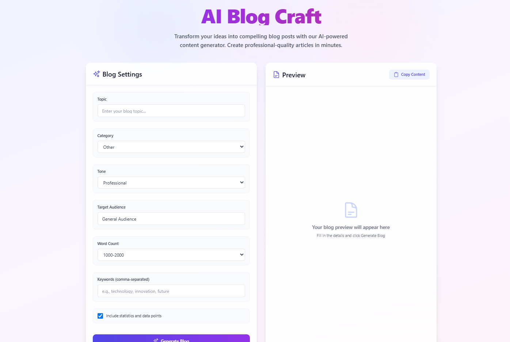
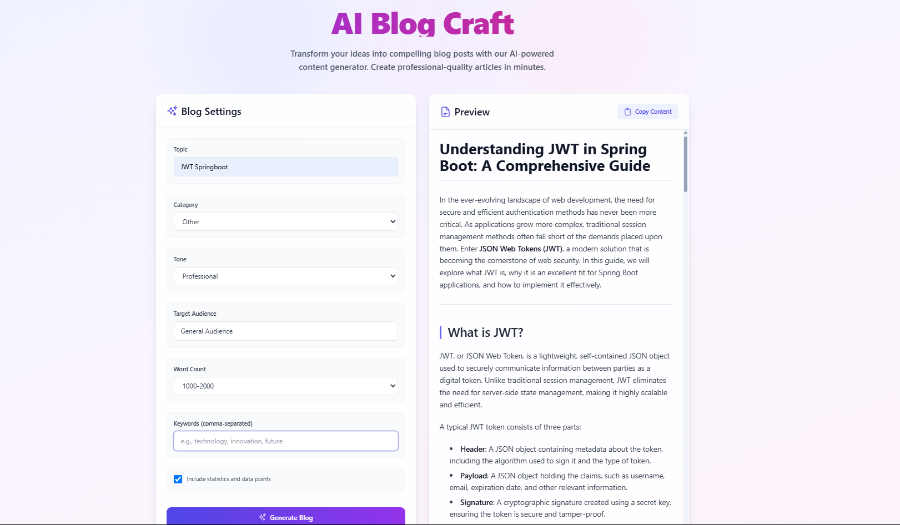

# AI Blog Craft 🚀

<div align="center">
  
  
  [](https://choosealicense.com/licenses/mit/)
  [](https://reactjs.org/)
  [](https://www.python.org/)
  [](https://tailwindcss.com/)
</div>

## 🌟 Overview

AI Blog Craft is a cutting-edge blog post generator that leverages artificial intelligence to create engaging, professional-quality content in minutes. Perfect for content creators, marketers, and anyone looking to generate well-structured blog posts efficiently.

## ✨ Features

- 🤖 **AI-Powered Content Generation** - Utilizes advanced AI to create human-like content
- 🎨 **Modern & Intuitive UI** - Beautiful, responsive interface built with React and Tailwind CSS
- 📝 **Multiple Tone Options** - Choose from Professional, Casual, Technical, Educational, or Entertaining tones
- 📊 **Flexible Word Count** - Select your desired content length from multiple presets
- 🎯 **Category Selection** - Multiple categories including Technology, Health, Business, and more
- 📈 **Statistics Integration** - Option to include relevant statistics and data points
- 👥 **Target Audience Customization** - Tailor content for specific audience segments
- 📋 **One-Click Copy** - Easy content copying with a single click

## 🖥️ Generated Blog Preview

<div align="center">
  
</div>

## 🛠️ Tech Stack

- **Frontend**:

  - React.js
  - Tailwind CSS
  - Heroicons
  - Axios

- **Backend**:
  - Python
  - Flask
  - OpenAI GPT
  - SQLite

## 📦 Installation

1. **Clone the repository**:

   ```bash
   git clone https://github.com/harithikchoudhary/MediumBlogGenerator.git
   cd MediumBlogGenerator
   ```

2. **Frontend Setup**:

   ```bash
   cd Frontend/medium-frontend
   npm install
   npm start
   ```

3. **Backend Setup**:

   ```bash
   cd Backend
   python -m venv venv
   source venv/bin/activate  # On Windows: venv\Scripts\activate
   pip install -r requirements.txt
   ```

4. **Environment Configuration**:
   Create a `.env` file in the Backend directory:
   ```env
   OPENAI_API_KEY=your_api_key_here
   ```

## 🖥️ Usage

1. Enter your desired blog topic
2. Select the appropriate category
3. Choose your preferred tone
4. Specify target audience
5. Set desired word count
6. Add relevant keywords
7. Toggle statistics inclusion if needed
8. Click "Generate Blog"
9. Review and copy your generated content

## 🤝 Contributing

Contributions are always welcome! Please read our [contributing guidelines](CONTRIBUTING.md) first.

1. Fork the repository
2. Create your feature branch (`git checkout -b feature/AmazingFeature`)
3. Commit your changes (`git commit -m 'Add some AmazingFeature'`)
4. Push to the branch (`git push origin feature/AmazingFeature`)
5. Open a Pull Request

## 📝 License

This project is licensed under the MIT License - see the [LICENSE](LICENSE) file for details.

## 🙏 Acknowledgments

- OpenAI for providing the GPT API
- React.js and Tailwind CSS communities
- All our contributors and users

## 📞 Contact

Harithik Choudhary - [@harithikchoudhary](https://github.com/harithikchoudhary)

Project Link: [https://github.com/harithikchoudhary/MediumBlogGenerator](https://github.com/harithikchoudhary/MediumBlogGenerator)
